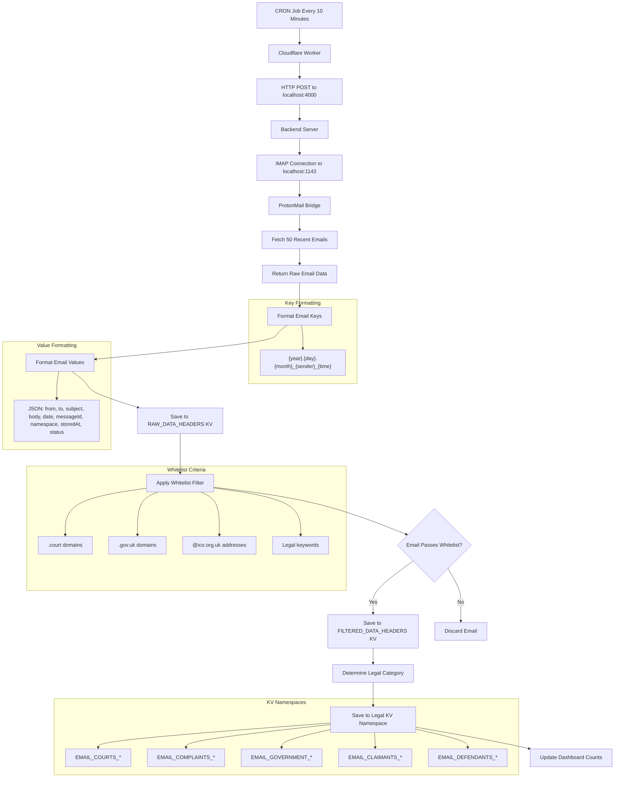

# Email Workflow Process Map



## Process Flow

1. **CRON Trigger** - Every 10 minutes
2. **Cloudflare Worker** - Processes the scheduled job
3. **Backend Call** - POST to `localhost:4000/fetch-emails`
4. **ProtonMail Bridge** - Backend connects to `localhost:1143`
5. **Email Retrieval** - Fetches 50 most recent emails from "All Mail"
6. **Raw Storage** - All emails saved to `RAW_DATA_HEADERS` with proper formatting
7. **Whitelist Filtering** - Apply legal domain/keyword filters
8. **Filtered Storage** - Relevant emails saved to `FILTERED_DATA_HEADERS`
9. **Legal Categorization** - Distribute emails to specific legal KV namespaces
10. **Dashboard Update** - Refresh counts and status

## Data Flow

```
ProtonMail Bridge (1143) 
    ↓
Backend Server (4000)
    ↓  
Cloudflare Worker
    ↓
RAW_DATA_HEADERS KV
    ↓
Whitelist Filter
    ↓
FILTERED_DATA_HEADERS KV
    ↓
Legal Category KV Namespaces
```